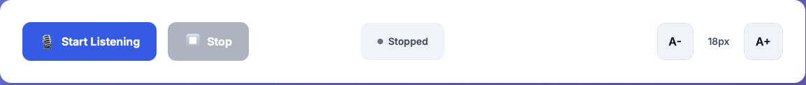

# SilentAid

An AI accessibility tool that transcribes speech to text and adds emotional context so users can see not just what is said, but how it’s said.

## Overview

SilentAid runs in the browser for live speech recognition and uses a Python/Flask backend with a HuggingFace model to classify emotions for each final transcript chunk. Lines are rendered with an emoji + emotion tag and color-coded for quick readability.

## Features

- Live transcription (Web Speech API)
- Emotion detection per line (Happy, Sad, Angry, Excited, Neutral)
- Emoji + color tag prefix (e.g., 😠 [Angry] text…)
- Status indicator: Idle / Listening / Processing / Stopped
- A+ / A- font size controls (persisted)
- Transcript history: last 20 visible, last 50 saved locally
- Clear error feedback and accessible UI

## Tech Stack

- Frontend: HTML, CSS, JavaScript (ES6), Web Speech API, LocalStorage
- Backend: Python, Flask, Flask-CORS
- AI/ML: HuggingFace Transformers (DistilRoBERTa), PyTorch
- Model: j-hartmann/emotion-english-distilroberta-base (text-based emotion)

## Architecture

- Frontend (Browser)
  - Captures microphone audio with Web Speech API
  - Sends final transcript text to backend
  - Receives {text, emotion, confidence} and renders the line
  - Stores and restores history from localStorage
- Backend (Flask)
  - /api/health — health check, model status
  - /api/emotion — POST { text } → returns { text, emotion, emoji/color mapping, confidence }
  - Uses Transformers pipeline to classify emotions; adds heuristics to better separate Excited from Happy

## Screenshots

Add images (PNG/JPG) into a `docs/` folder and update paths below.

- App Header & Controls
  - 
- Live Transcript with Emotions
  - 
- Font Controls & History
  - 

Tip: On macOS you can take screenshots with Shift+Cmd+4 and save into `docs/`.

## Quick Start

1. Start the backend (first run downloads the model):

- macOS/Linux:
  - `./start_backend.sh`
- Windows (PowerShell):
  - `python -m venv backend\venv`
  - `backend\venv\Scripts\activate`
  - `pip install -r backend\requirements.txt`
  - `python backend\app.py`

2. Open the frontend in Chrome:

- Open `frontend/index.html`

## How to Use (Demo Guide)

1. Click “Start Listening” and allow microphone access.
2. Speak short sentences; each final chunk is analyzed.
3. See lines appear with an emoji + color-coded emotion tag.
4. Use A+ / A- to adjust font size.
5. Click “Stop” to stop recognition (status shows Stopped).

Emotion cues examples:

- Excited: “Wow! This is amazing! I can’t wait!”
- Happy: “I’m really pleased with the result.”
- Sad: “I’m disappointed about what happened.”
- Angry: “This is unacceptable and frustrating.”

## Color Mapping

- 😊 Happy — Green
- 😢 Sad — Blue
- 😠 Angry — Red
- 🤩 Excited — Orange
- 😐 Neutral — Gray

## API

- GET /api/health → `{ status, model_loaded }`
- POST /api/emotion → body `{ text: string }` returns:

```json
{
  "text": "I can’t do this right now.",
  "emotion": "Angry",
  "emoji": "😠",
  "color": "#ef4444",
  "confidence": 0.91,
  "timestamp": "2025-08-31T12:34:56.000Z"
}
```

## Project Structure

```
SilentAid/
├─ frontend/
│  ├─ index.html
│  ├─ style.css
│  └─ script.js
├─ backend/
│  ├─ app.py
│  └─ requirements.txt
├─ start_backend.sh
└─ README.md
```

## Notes & Limitations

- Best in Chrome (Web Speech API support)
- English text only (MVP)
- Emotion is inferred from text (not vocal tone)
- First backend run needs Internet to download the model

## Credits

Built with Web Speech API, Flask, and HuggingFace Transformers for the hackathon demo of SilentAid — accessibility-focused, fast to run, and easy to show.
